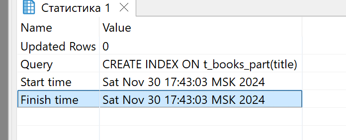
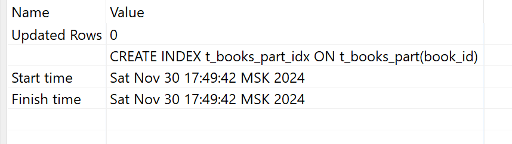
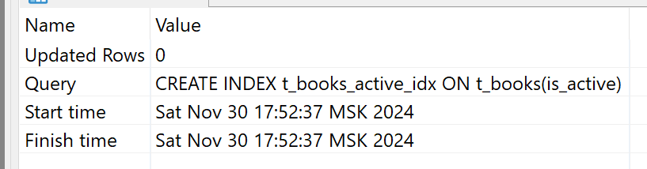
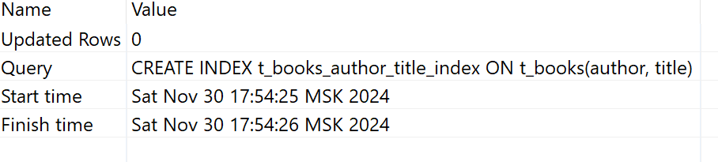
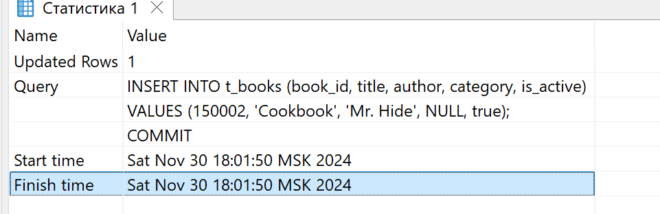
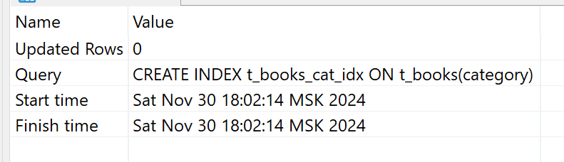

# Задание 2: Специальные случаи использования индексов

# Партиционирование и специальные случаи использования индексов

1. Удалите прошлый инстанс PostgreSQL - `docker-compose down` в папке `src` и запустите новый: `docker-compose up -d`.

2. Создайте партиционированную таблицу и заполните её данными:

    ```sql
    -- Создание партиционированной таблицы
    CREATE TABLE t_books_part (
        book_id     INTEGER      NOT NULL,
        title       VARCHAR(100) NOT NULL,
        category    VARCHAR(30),
        author      VARCHAR(100) NOT NULL,
        is_active   BOOLEAN      NOT NULL
    ) PARTITION BY RANGE (book_id);

    -- Создание партиций
    CREATE TABLE t_books_part_1 PARTITION OF t_books_part
        FOR VALUES FROM (MINVALUE) TO (50000);

    CREATE TABLE t_books_part_2 PARTITION OF t_books_part
        FOR VALUES FROM (50000) TO (100000);

    CREATE TABLE t_books_part_3 PARTITION OF t_books_part
        FOR VALUES FROM (100000) TO (MAXVALUE);

    -- Копирование данных из t_books
    INSERT INTO t_books_part 
    SELECT * FROM t_books;
    ```

3. Обновите статистику таблиц:
   ```sql
   ANALYZE t_books;
   ANALYZE t_books_part;
   ```
   
   *Результат:*
   
   просто обновили статистику таблиц после созданию индекса

4. Выполните запрос для поиска книги с id = 18:
   ```sql
   EXPLAIN ANALYZE
   SELECT * FROM t_books_part WHERE book_id = 18;
   ```
   
   *План выполнения:*
   

|Seq Scan on t_books_part_1 t_books_part  (cost=0.00..1032.99 rows=1 width=32) (actual time=0.006..2.421 rows=1 loops=1)|
|  Filter: (book_id = 18)|
|  Rows Removed by Filter: 49998|
|Planning Time: 0.243 ms|
|Execution Time: 2.432 ms|

   
   *Объясните результат:*
   Оптимизатор прове паралельное сканирование на основе партитиций. Наш айдишник попал в первую часть этой партиции, поэтому и время работы вышло минимальным

1. Выполните поиск по названию книги:
   ```sql
   EXPLAIN ANALYZE
   SELECT * FROM t_books_part 
   WHERE title = 'Expert PostgreSQL Architecture';
   ```
   
   *План выполнения:*
   

|Append  (cost=0.00..3100.01 rows=3 width=33) (actual time=2.055..6.144 rows=1 loops=1)|
|  ->  Seq Scan on t_books_part_1  (cost=0.00..1032.99 rows=1 width=32) (actual time=2.054..2.055 rows=1 loops=1)|
|        Filter: ((title)::text = 'Expert PostgreSQL Architecture'::text)|
|        Rows Removed by Filter: 49998|
|  ->  Seq Scan on t_books_part_2  (cost=0.00..1033.00 rows=1 width=33) (actual time=2.128..2.128 rows=0 loops=1)|
|        Filter: ((title)::text = 'Expert PostgreSQL Architecture'::text)|
|        Rows Removed by Filter: 50000|
|  ->  Seq Scan on t_books_part_3  (cost=0.00..1034.01 rows=1 width=34) (actual time=1.958..1.958 rows=0 loops=1)|
|        Filter: ((title)::text = 'Expert PostgreSQL Architecture'::text)|
|        Rows Removed by Filter: 50001|
|Planning Time: 0.059 ms|
|Execution Time: 6.160 ms|

   
   *Объясните результат:*
   Так как условие нашей фильтрации никак не связано с проиндексированным полем, на основе которого происходило создание партиций, то запрос будет сканировать все партии последовательно, отсюда идёт снижение производительности

1. Создайте партиционированный индекс:
   ```sql
   CREATE INDEX ON t_books_part(title);
   ```
   
   *Результат:*
   
   

2. Повторите запрос из шага 5:
   ```sql
   EXPLAIN ANALYZE
   SELECT * FROM t_books_part 
   WHERE title = 'Expert PostgreSQL Architecture';
   ```
   
   *План выполнения:*
   
   

|Append  (cost=0.29..24.94 rows=3 width=33) (actual time=0.019..0.044 rows=1 loops=1)|
|  ->  Index Scan using t_books_part_1_title_idx on t_books_part_1  (cost=0.29..8.31 rows=1 width=32) (actual time=0.018..0.018 rows=1 loops=1)|
|        Index Cond: ((title)::text = 'Expert PostgreSQL Architecture'::text)|
|  ->  Index Scan using t_books_part_2_title_idx on t_books_part_2  (cost=0.29..8.31 rows=1 width=33) (actual time=0.012..0.012 rows=0 loops=1)|
|        Index Cond: ((title)::text = 'Expert PostgreSQL Architecture'::text)|
|  ->  Index Scan using t_books_part_3_title_idx on t_books_part_3  (cost=0.29..8.31 rows=1 width=34) (actual time=0.012..0.012 rows=0 loops=1)|
|        Index Cond: ((title)::text = 'Expert PostgreSQL Architecture'::text)|
|Planning Time: 0.296 ms|
|Execution Time: 0.071 ms|

   
   *Объясните результат:*
   Описанная ранее проблема теперь решена и запрос обращается уже не ко всем пратициям и не проходится по ним последовательно, а использует проиндексированное поле для этого, отсюда видим улучшение производительности.

1. Удалите созданный индекс:
   ```sql
   DROP INDEX t_books_part_title_idx;
   ```
   
   *Результат:*
   
   индекс удалился

2. Создайте индекс для каждой партиции:
   ```sql
   CREATE INDEX ON t_books_part_1(title);
   CREATE INDEX ON t_books_part_2(title);
   CREATE INDEX ON t_books_part_3(title);
   ```
   
   *Результат:*
   [Вставьте результат выполнения]

3.  Повторите запрос из шага 5:
    ```sql
    EXPLAIN ANALYZE
    SELECT * FROM t_books_part 
    WHERE title = 'Expert PostgreSQL Architecture';
    ```
    
    *План выполнения:*
    

|Append  (cost=0.29..24.94 rows=3 width=33) (actual time=0.012..0.048 rows=1 loops=1)|
|  ->  Index Scan using t_books_part_1_title_idx on t_books_part_1  (cost=0.29..8.31 rows=1 width=32) (actual time=0.011..0.012 rows=1 loops=1)|
|        Index Cond: ((title)::text = 'Expert PostgreSQL Architecture'::text)|
|  ->  Index Scan using t_books_part_2_title_idx on t_books_part_2  (cost=0.29..8.31 rows=1 width=33) (actual time=0.024..0.024 rows=0 loops=1)|
|        Index Cond: ((title)::text = 'Expert PostgreSQL Architecture'::text)|
|  ->  Index Scan using t_books_part_3_title_idx on t_books_part_3  (cost=0.29..8.31 rows=1 width=34) (actual time=0.010..0.010 rows=0 loops=1)|
|        Index Cond: ((title)::text = 'Expert PostgreSQL Architecture'::text)|
|Planning Time: 0.246 ms|
|Execution Time: 0.063 ms|

    
    *Объясните результат:*
    Оптимизатор теперь использует индексное поле, откуда получаем не полный обход таблицы, а индексное сканирование

1.  Удалите созданные индексы:
    ```sql
    DROP INDEX t_books_part_1_title_idx;
    DROP INDEX t_books_part_2_title_idx;
    DROP INDEX t_books_part_3_title_idx;
    ```
    
    *Результат:*
    
    удалили созданные индексы

2.  Создайте обычный индекс по book_id:
    ```sql
    CREATE INDEX t_books_part_idx ON t_books_part(book_id);
    ```
    
    *Результат:*
    
    

3.  Выполните поиск по book_id:
    ```sql
    EXPLAIN ANALYZE
    SELECT * FROM t_books_part WHERE book_id = 11011;
    ```
    
    *План выполнения:*
    

|Index Scan using t_books_part_1_book_id_idx on t_books_part_1 t_books_part  (cost=0.29..8.31 rows=1 width=32) (actual time=0.012..0.013 rows=1 loops=1)|
|  Index Cond: (book_id = 11011)|
|Planning Time: 0.244 ms|
|Execution Time: 0.026 ms|

    
    *Объясните результат:*
    
    Ну получили обычное индексное сканирование с бинарным поиском айдишника по индексному полю, как делали в первой таске.

1.  Создайте индекс по полю is_active:
    ```sql
    CREATE INDEX t_books_active_idx ON t_books(is_active);
    ```
    
    *Результат:*
    
    

2.  Выполните поиск активных книг с отключенным последовательным сканированием:
    ```sql
    SET enable_seqscan = off;
    EXPLAIN ANALYZE
    SELECT * FROM t_books WHERE is_active = true;
    SET enable_seqscan = on;
    ```
    
    *План выполнения:*
    

|Bitmap Heap Scan on t_books  (cost=840.07..2812.17 rows=74810 width=33) (actual time=1.811..6.857 rows=74945 loops=1)|
|  Recheck Cond: is_active|
|  Heap Blocks: exact=1224|
|  ->  Bitmap Index Scan on t_books_active_idx  (cost=0.00..821.37 rows=74810 width=0) (actual time=1.690..1.691 rows=74945 loops=1)|
|        Index Cond: (is_active = true)|
|Planning Time: 0.266 ms|
|Execution Time: 8.290 ms|

    
    *Объясните результат:*
    [Ваше объяснение]

1.  Создайте составной индекс:
    ```sql
    CREATE INDEX t_books_author_title_index ON t_books(author, title);
    ```
    
    *Результат:*
    
    

2.  Найдите максимальное название для каждого автора:
    ```sql
    EXPLAIN ANALYZE
    SELECT author, MAX(title) 
    FROM t_books 
    GROUP BY author;
    ```
    
    *План выполнения:*
    

|HashAggregate  (cost=3474.00..3484.00 rows=1000 width=42) (actual time=31.429..31.507 rows=1003 loops=1)|
|  Group Key: author|
|  Batches: 1  Memory Usage: 193kB|
|  ->  Seq Scan on t_books  (cost=0.00..2724.00 rows=150000 width=21) (actual time=0.005..5.178 rows=150000 loops=1)|
|Planning Time: 0.055 ms|
|Execution Time: 31.550 ms|

    
    *Объясните результат:*
    Довольно длительное выполнение запроса из-за того, что у нас составной индекс, а группировка при этом только по полю автора.

1.  Выберите первых 10 авторов:
    ```sql
    EXPLAIN ANALYZE
    SELECT DISTINCT author 
    FROM t_books 
    ORDER BY author 
    LIMIT 10;
    ```
    
    *План выполнения:*
    
|Limit  (cost=0.42..56.63 rows=10 width=10) (actual time=0.084..0.266 rows=10 loops=1)|
|  ->  Result  (cost=0.42..5621.42 rows=1000 width=10) (actual time=0.083..0.265 rows=10 loops=1)|
|        ->  Unique  (cost=0.42..5621.42 rows=1000 width=10) (actual time=0.083..0.263 rows=10 loops=1)|
|              ->  Index Only Scan using t_books_author_title_index on t_books  (cost=0.42..5246.42 rows=150000 width=10) (actual time=0.082..0.195 rows=1387 loops=1)|
|                    Heap Fetches: 1|
|Planning Time: 0.065 ms|
|Execution Time: 0.335 ms|

    
    *Объясните результат:*
    Ну а здесь результат того, о чём говорилось в предыдущем пунтке - при группировке только по автору (дистинк можно рассматривать как аналог группировки), получили что запрос выполняется молниеносно, т.к. индекс привязан только к полю автора

1.  Выполните поиск и сортировку:
    ```sql
    EXPLAIN ANALYZE
    SELECT author, title 
    FROM t_books 
    WHERE author LIKE 'T%'
    ORDER BY author, title;
    ```
    
    *План выполнения:*
    
    

|Sort  (cost=3099.29..3099.33 rows=15 width=21) (actual time=7.213..7.214 rows=1 loops=1)|
|  Sort Key: author, title|
|  Sort Method: quicksort  Memory: 25kB|
|  ->  Seq Scan on t_books  (cost=0.00..3099.00 rows=15 width=21) (actual time=7.205..7.207 rows=1 loops=1)|
|        Filter: ((author)::text ~~ 'T%'::text)|
|        Rows Removed by Filter: 149999|
|Planning Time: 0.077 ms|
|Execution Time: 7.230 ms|

    
    *Объясните результат:*
    [Ваше объяснение]

1.  Добавьте новую книгу:
    ```sql
    INSERT INTO t_books (book_id, title, author, category, is_active)
    VALUES (150001, 'Cookbook', 'Mr. Hide', NULL, true);
    COMMIT;
    ```
    
    *Результат:*
    
    

2.  Создайте индекс по категории:
    ```sql
    CREATE INDEX t_books_cat_idx ON t_books(category);
    ```
    
    *Результат:*
    
    

3.  Найдите книги без категории:
    ```sql
    EXPLAIN ANALYZE
    SELECT author, title 
    FROM t_books 
    WHERE category IS NULL;
    ```
    
    *План выполнения:*
    Index Scan using t_books_cat_idx on t_books  (cost=0.29..8.15 rows=1 width=21) (actual time=0.015..0.016 rows=2 loops=1)
  Index Cond: (category IS NULL)
Planning Time: 0.171 ms
Execution Time: 0.028 ms
    
    *Объясните результат:*
    b-tree, которое создаётся по умолчанию, поддерживает операторы сравнения is/is not null, поэтому здесь всё работает

4.  Создайте частичные индексы:
    ```sql
    DROP INDEX t_books_cat_idx;
    CREATE INDEX t_books_cat_null_idx ON t_books(category) WHERE category IS NULL;
    ```
    
    *Результат:*
    [Вставьте результат выполнения]

5.  Повторите запрос из шага 22:
    ```sql
    EXPLAIN ANALYZE
    SELECT author, title 
    FROM t_books 
    WHERE category IS NULL;
    ```
    
    *План выполнения:*
    [Вставьте план выполнения]
    
    *Объясните результат:*
    [Ваше объяснение]

6.  Создайте частичный уникальный индекс:
    ```sql
    CREATE UNIQUE INDEX t_books_selective_unique_idx 
    ON t_books(title) 
    WHERE category = 'Science';
    
    -- Протестируйте его
    INSERT INTO t_books (book_id, title, author, category, is_active)
    VALUES (150002, 'Unique Science Book', 'Author 1', 'Science', true);
    
    -- Попробуйте вставить дубликат
    INSERT INTO t_books (book_id, title, author, category, is_active)
    VALUES (150003, 'Unique Science Book', 'Author 2', 'Science', true);
    
    -- Но можно вставить такое же название для другой категории
    INSERT INTO t_books (book_id, title, author, category, is_active)
    VALUES (150004, 'Unique Science Book', 'Author 3', 'History', true);
    ```
    
    *Результат:*
    [Вставьте результаты всех операций]
    
    *Объясните результат:*
    [Ваше объяснение]